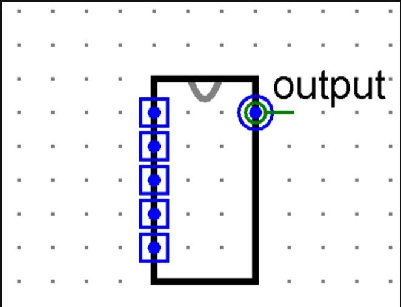
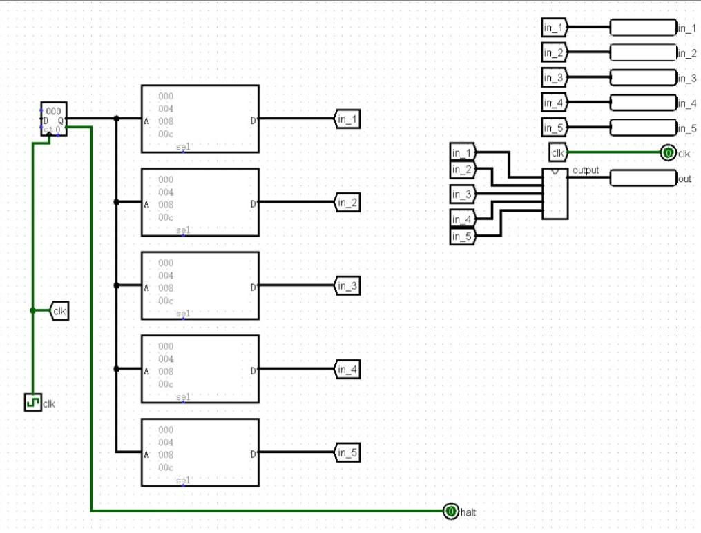
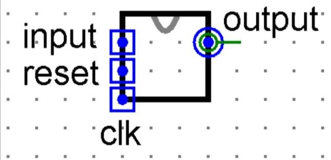

# BUAA CO 2023 P0 题面

## T1 十六进制数匹配

### 题目描述

使用 Logisim 设计时序电路。每个时钟周期串行输入一个 4 位十六进制数，检测最近连续输入的三个数是否构成 `A0E`、`EEE` 或 `0A0`，输出对应的 2 位匹配结果。

每接收一个新数，就以截至该次输入的最近三个数重新判断。匹配可以重叠，命中后继续保留有效输入历史，不重新开始计数。

### 输入输出

| 名称 | 方向 | 位宽 | 功能 |
| --- | --- | --- | --- |
| `input` | 输入 | 4 | 当前输入的十六进制数 |
| `clk` | 输入 | 1 | 时钟信号 |
| `reset` | 输入 | 1 | 高电平有效的异步复位信号 |
| `output` | 输出 | 2 | 匹配结果 |

| 最近三个输入（从先到后） | `output` |
| --- | --- |
| `A, 0, E` | `01` |
| `E, E, E` | `10` |
| `0, A, 0` | `11` |
| 其他情况 | `00` |

输入可以取 `0` 至 `F` 中的任意十六进制数。不属于 `0`、`A`、`E` 的数同样计入输入序列。

### 时序与复位要求

- `reset = 0` 时，在每个时钟上升沿接收一个输入。输出反映该上升沿接收完成后的最近三个输入。
- `reset = 1` 时，不等待时钟上升沿，立即将输出清零，并清除此前的有效输入历史。
- 复位解除后，从新接收的输入开始计数。不足三个有效输入时，输出 `00`，不得将内部初始值作为有效输入参与匹配。
- 接收到至少三个有效输入后，每次按最新的三个输入更新结果。未命中时输出 `00`，不保留上一次命中的输出。

文件内模块名为 `main`。

## T2 未出现的正整数

### 题目描述

使用 Logisim 搭建组合电路。给定五个任意的 8 位无符号二进制数，求这些输入中未出现的最小正整数。

五个输入可以重复，数值 `0` 不属于正整数。

### 输入输出

| 名称 | 方向 | 位宽 | 功能 |
| --- | --- | --- | --- |
| `input1` | 输入 | 8 | 第一个无符号整数 |
| `input2` | 输入 | 8 | 第二个无符号整数 |
| `input3` | 输入 | 8 | 第三个无符号整数 |
| `input4` | 输入 | 8 | 第四个无符号整数 |
| `input5` | 输入 | 8 | 第五个无符号整数 |
| `output` | 输出 | 8 | 输入中未出现的最小正整数 |

输入、输出均按 8 位无符号二进制数处理。

### 提交与外观要求

- 提交题目为 `P0_L2_nonexist_2023`。
- 文件内模块名为 `main`。
- 必须以组合电路的方式实现。
- 模块的 appearance 须与下图一致。黑色矩形框的大小可以不必调整，其余部分的相对位置必须正确。

测试电路如下。

## T3 回字楼游走

### 题目描述

使用 Logisim 设计 Mealy 型状态机，模拟在回字形建筑中移动的学生。

某校有一栋回字形建筑，可以分为八个单元，由右上角起顺时针编号为 `1` 至 `8`，结成一个环。一名学生从编号为 `1` 的东北角单元开始移动。

- 当学生恰好向相邻单元的方向移动时，学生进入该相邻单元，输出其编号。
- 当学生的移动方向上没有单元时，本次不移动，直接输出当前所在单元的编号。

### 输入输出

| 名称 | 功能 | 位宽 | 方向 |
| --- | --- | --- | --- |
| `input` | 方向输入 | 2 | 输入 |
| `reset` | 异步复位信号 | 1 | 输入 |
| `clk` | 时钟信号 | 1 | 输入 |
| `output` | 结果 | 4 | 输出 |

| `input` | 移动方向 |
| --- | --- |
| `00` | 上（北） |
| `01` | 下（南） |
| `10` | 左（西） |
| `11` | 右（东） |

输出学生本次尝试移动所到达的建筑单元编号，位宽为 4 位。

### 实现与外观要求

- 文件内模块名为 `main`。
- 必须以 Mealy 型状态机的方式实现。
- 请保证模块的 appearance 与下图一致，否则可能造成评测错误。注意输入引脚的上下顺序。

