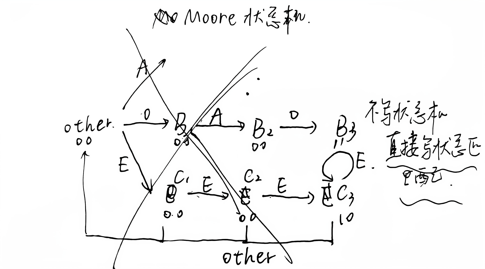

# 十六进制数匹配

本来想做成状态机检验的，画了状态转移图，但是画着画着发现，这样第一个情况和 第三个情况他们需要共用一个状态，状态机只有当前状态没有之前的输入，那么无法分辨，所以看了看题目决定直接写状态匹配，选对方法后很快就做出来啦啦啦 ~

# 未出现的正整数

这道题初看是混淆的，没看明白什么叫未出现的最小正整数，（其实一开始想到了是最小的数，然后不能和输入的重复，但是当时不相信自己，所以一遍又一遍读题，最后左右脑互博成功）

我最开始的想法，构造一个5个数的排序模块，根据之前我们的swap就可以算出来，但是GPT大人给了我狠狠的一击，因为总共就5个数，只需要判断最低的五个最小正整数有没有和输入有重复就是可以的了，然后那个最低的没有重复的就是最小的

> [!CAUTION]
>
> 我的思路很明显是编程思维，但是这里是硬件语言，要慢慢转换思维惯性，一个串行，一个并行且不擅长<mark>迭代</mark>

# 回字楼游走

这道题难度不大，可以参看2025 Pre里面的那道迷宫题目，建立一个坐标系，再判断墙体就很简单了，只是需要多一个输出转换，根据x，y的值，进行输出的分流配置即可，这里可以用y或x用MUX进行分流，再分别构造函数即可